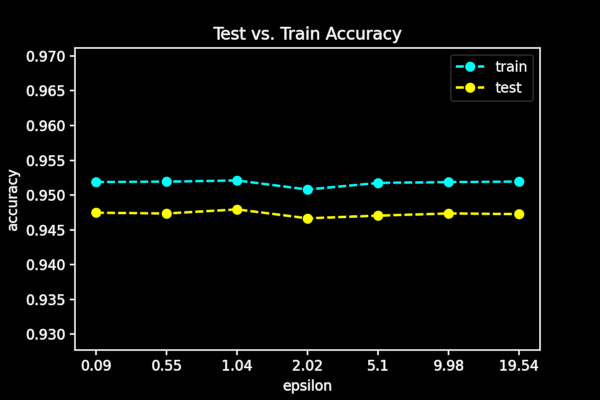
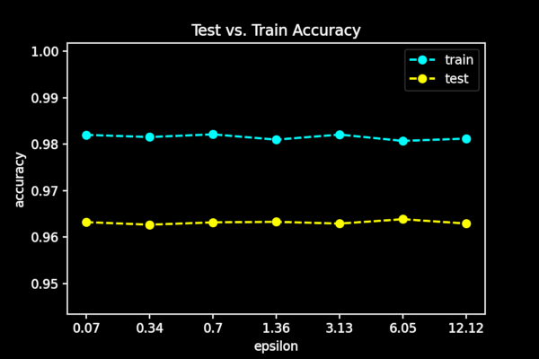
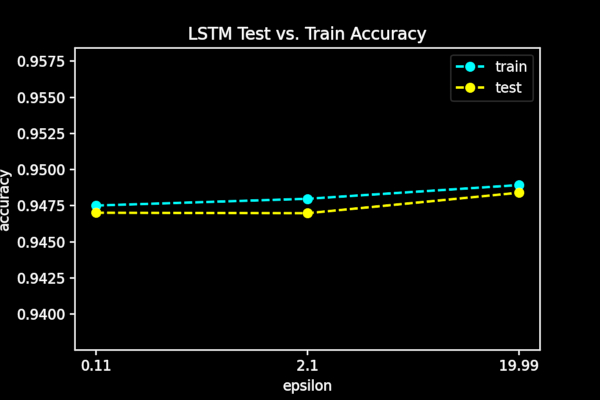
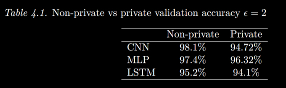

# Differentially-private domain generation algorithm detection

## Background

This work demonstrates a novel means of producing a differentially-private machine learning model for the purpose of domain-generation algorithm detection. We demonstrate the process by which a trained model can be made quantifiably private against adverserial analysis. An algorithm is said to be differentially private if it satisfies the following requirements:

$\Pr[M(x) \in S] \leq \exp(e) \Pr[Y \in S] + \delta$

That is, an algorithm is private if it produces consecutive results that are generally identical regardless of whether a single entry is present within the database that is queried. Our objective in this research is to produce a machine learning model which reveals no information about the data it was trained on.

This work is based on the efforts of Ricardo Maia involving secure multi-party DGA detection. 

## Results

We present experimental results of differentially-private model training across three common machine learning architectures:

## CNN results:

## MLP results:

## LSTM results:

## Non-DP vs DP Prediction Accuracy:

Our measurements show a modest but expected decrease in model utility when privacy is added to the training process. We note that given greater training time, stronger hardware, and smaller batch sizes, we obtain higher accuracies in the private setting. 

## Technologies

* Tensorflow-Privacy (contains bolt-on differential privacy auto diff engine and SGD variant)
* Keras

## Future Work

Differentially-private stochastic gradient descent alters the procedure by which queries are made over a dataset at the cost of performance enhancements when performed in a non-private training setting. Future work remains to demonstrate the viability of vectorized approaches to the differentially private training process such that parallel hardware can be leveraged. 

## Publications

This work appears in the publication titled "Secure Multi-Party Computation and Differential Privacy Applied to DGA Detection" which is submitted for preprint and currently under review. 

